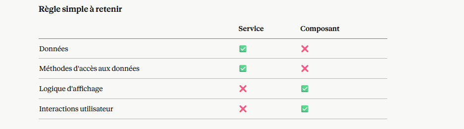

15/04/26 
Une instance c'est un objet créé à partir d'une classe.
Classe MaterielService → le moule
Instance               → l'objet créé à partir du moule
                         qui a toutes les méthodes et propriétés de la classe
Donc l'instance de MaterielService a forcément :

la méthode getCategories()
le tableau categories

15/04/26 12:21
Oui exactement ! Bonne synthèse :

Service → gère les données (qu'elles viennent d'une API ou en dur) + méthodes pour les manipuler
Composant → gère uniquement l'affichage et les interactions utilisateur

C'est le principe de séparation des responsabilités — chaque partie a son rôle bien défini. Exactement comme en C# avec le pattern MVC :

Service → Model
Composant → Controller + View

15/04/26 12:31

📝 Récap du jour
Services Angular
Un service e&&&&&&&&&&&&&&&&&&&&&&&&&&&&&&&&&&&&&&&&&&&        st une classe qui centralise les données et les méthodes pour y accéder.
Pourquoi ?

Éviter de répéter les données dans chaque composant
Séparer la logique des données de la logique d'affichage

Créer un service :
**ng generate service services/materiel**
Structure d'un service :
@Injectable({ providedIn: 'root' })
export class MaterielService {
  private categories: Categorie[] = [...]
  
  getCategories(): Categorie[] {
    return this.categories
  }
}
Utiliser un service dans un composant :

**constructor(private materielService: MaterielService)**{
  this.categories = this.materielService.getCategories()
}

Règle simple à retenir

-------------

 Récap complet du projet LocaRial
Structure du projet ✅
src/app/
├── accueil/
├── composant-categorie/
├── composant-connexion/
├── composant-contact/
├── composant-navbar/
└── services/
    └── materiel.ts
    j'ai rajouter **auth.ts** aussi

Composants créés ✅
Navbar (composant-navbar)

Liens de navigation avec routerLink
Bouton hamburger pour mobile

Accueil (accueil)

Section titre principal
Section présentation plateforme (3 cartes)

Catalogue (composant-categorie)

3 niveaux : catégories → modèles → détail
Formulaire de location avec date début/fin
Calcul du prix selon la durée
Données centralisées dans MaterielService

Connexion (composant-connexion)

Formulaire connexion
Formulaire inscription
Switch entre les deux avec ngModel

Contact (composant-contact)

Créé mais pas encore développé

Concepts Angular appris ✅

Components et arborescence
Routing (app.routes.ts)
routerLink et router-outlet
@if / @else if / @else
@for avec track
[(ngModel)] binding bidirectionnel
(click) event binding
[class.open] class binding
Interfaces TypeScript
Services et injection de dépendances

categories
└── Ordinateurs Portables        ← categorie.nom
    └── modeles
        ├── Dell XPS             ← modele.nom
        └── Lenovo ThinkPad      ← modele.nom
└── Imprimantes                  ← categorie.nom
    └── modeles
        ├── Imprimante HP        ← modele.nom
        └── Canon Pixma          ← modele.nom